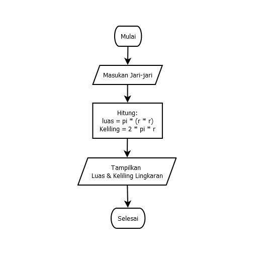

# Putri-Fadyra
## Belajar Tag Dasar HTML

### Membuat Paragraf 
Kode tag untuk paragraf adalah "
"
Ini adalah tampilannya

### Lab 1
Gambar Lab 1 "
"
Output

### Lab 2
Gambar Lab 2 "
"

### Rumus Lingkaran
Gambar Rumus Lingkaran "
"

### Flowchart Lingkaran
Flowchart Rumus Lingkaran "
"

